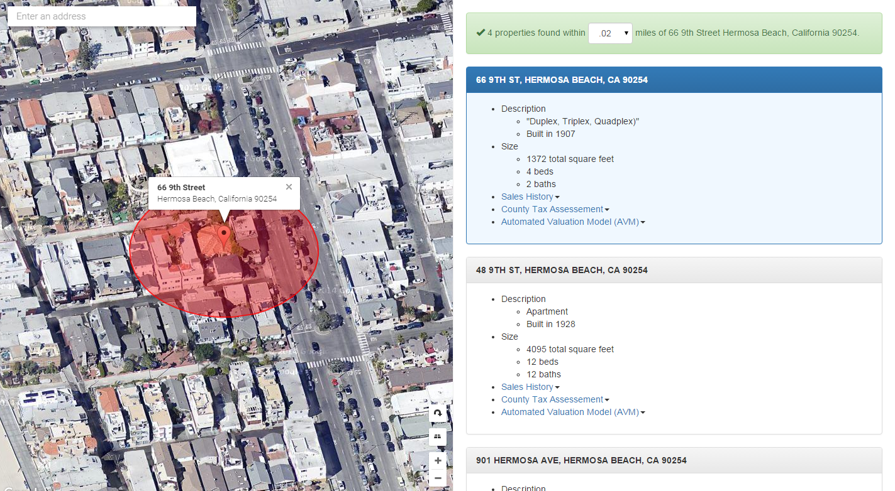
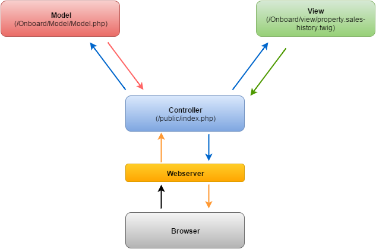

[](http://www.onboardinformatics.com)

# Onboard Rocks

## What is Onboard Rocks ?

An open-source PHP application using the Onboard Informatics Property API.  It is based on 150 million US property records.  View
a live demo here http://onboard.rocks/, Sign up for developer access to the API here, [[https://developer.onboard-apis.com/](https://developer.onboard-apis.com/)].

It was built using the [[Mini 2 application](https://github.com/panique/mini2)].
An extremely simple PHP barebone / skeleton application built on top of the wonderful Slim router / micro framework
[[1](http://www.slimframework.com/)] [[2](https://github.com/codeguy/Slim)] [[docs](http://docs.slimframework.com)].

## Features

- Search for properties based on address and radius
- Pagination through result set
- Return sales history for property based on property ID
- Return county tax assessment for property based on property ID
- Return AVM for property based on property ID

By default MINI allows user access to /public folder. The rest of the application (including .git files, swap files,
etc) is not accessible.

## Requirements

- Apache 2.2+
- PHP 5.3+
- cURL
- mod_rewrite activated, document root routed to /public (tutorial below)
- [Composer](https://getcomposer.org/) 

Maybe useful: Simple tutorials on setting up a LAMP stack on 
[Ubuntu 14.04 LTS](http://www.dev-metal.com/installsetup-basic-lamp-stack-linux-apache-mysql-php-ubuntu-14-04-lts/)
and [12.04 LTS](http://www.dev-metal.com/setup-basic-lamp-stack-linux-apache-mysql-php-ubuntu-12-04/), [Windows/WAMP](http://www.wampserver.com/en/),
or [OSX/Homebrew](https://guynathan.com/install-lamp-stack-on-mavericks-with-homebrew-with-php-mcrypt).

## Screenshot

[](http://onboard.rocks/)

## Installation

##### 1. Activate mod_rewrite and ...

Tutorials for [Apache2](http://stackoverflow.com/questions/869092/how-to-enable-mod-rewrite-for-apache-2-2).
 
##### 2. ... route all requests to /public folder of the script
 
Change the VirtualHost file from `DocumentRoot /var/www/html` to `DocumentRoot /var/www/html/public` and from
`<Directory "/var/www/html">` to `<Directory "/var/www/html/public">`. Don't forget to restart. By the way this is also 
mentioned in the official Slim documentation, but 
[hidden quite much](http://docs.slimframework.com/#Route-URL-Rewriting).

##### 3. Get dependencies via Composer
 
Do a `composer install` in the project's root folder to fetch the dependencies (and to create the autoloader).

##### 3. Insert Property API Key

Sign up for developer access to Onboard's Property API here, https://developer.onboard-apis.com/  Once your account is created
log in and go to Account >> Applications.  Create a new application.  Copy the API Key and paste into "THE CONFIGS" section of /public/index.php

## Usage

This application is built using the MVC paradigm so that the routing, data access, and presentation layer are all decoupled.  This should enable you
to more easily modify it to suit your needs.  Here is what the flow looks like:

##### 1. Controller

Load the index page (/public/index.php):

```php
$app->get('/', function () use ($app) {
    $app->render('index.twig');
});
``` 

Load property records search results page:

```php
$app->get('/search', function () use ($app) {
    $app->render('property-records.twig');
});
```

##### 2. Model

The data access layer which makes all of the calls to Onboard's Property API via a cURL function.

Load property records search results page (/Onboard/Model/Model.php):

```php
     * Property Search by Address
     * Return summary of properties within a radius of an address
     * @param $address1, $address2, $radius
     * @return JSON
     
    public function searchPropertyByAddress($address1, $address2, $radius, $page)
    {
	$address1 = urlencode($address1);
	$address2 = urlencode($address2);
  
	$url = $this->obpropapiurl . "property/snapshot?address1=" . $address1 . "&address2=" . $address2 . "&radius=" . $radius . "&page=" . $page . "&orderBy=distance%20asc";
    
	return $this->curlOnboardAPI($url);  
    }
```

##### 3. View

The presentation layer (/Onboard/view/property.sales-history.twig).

Display the property sales history:

```php
    
    <ul>    
        
            
                <li>{{ sale.saleTransDate|date }}
                | ${{ sale.amount.saleamt|number_format }}
                (${{ sale.calculation.pricepersizeunit|number_format }}/sqft
                | ${{ sale.calculation.priceperbed|number_format }}/per bedroom) 
                | {{ sale.amount.saletranstype }}
                </li>
            
        
            <li>No sales history record found ({{ statusmsg }}).</li>
            
    </ul>
    
```

##### 4. Application Flow Diagram

[]

#### Scripts used

MINI 2
https://github.com/panique/mini2

Slim
http://www.slimframework.com/

Twig
http://twig.sensiolabs.org/

SASS Compiler
https://github.com/panique/php-sass

CSS / JS Minifier
http://www.mullie.eu/dont-build-your-own-minifier/

## Change log

12/31/2015 - Initial Commit
1/13/16 - Updated Readme


## Support

imonko@onboardinformatics.com

